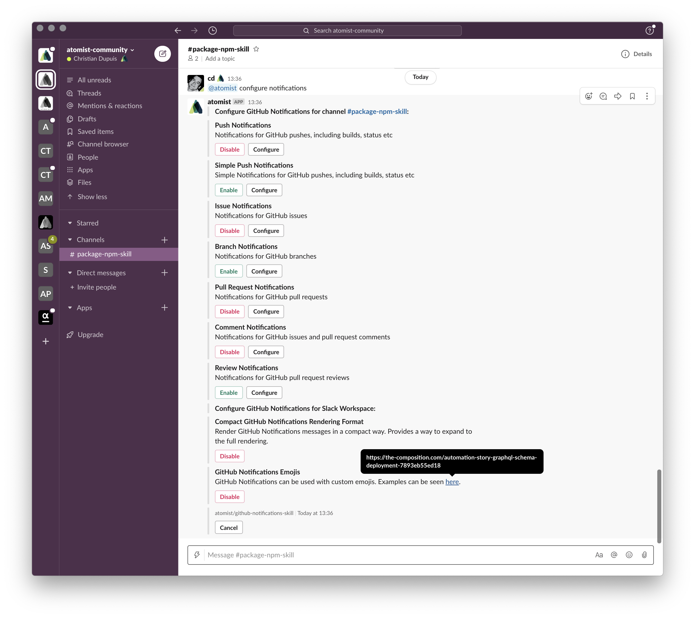

## Before you get started

Connect and configure these integrations:

1.  [**GitHub**][github] _(required)_
2.  [**Slack**][slack] or [**Microsoft Teams**][msteams] _(required)_

[github]: https://go.atomist.com/catalog/integration/github "GitHub Integration"
[slack]: https://go.atomist.com/catalog/integration/slack "Slack Integration"
[msteams]:
    https://go.atomist.com/catalog/integration/microsoft-teams
    "Microsoft Teams Integration"

## How to configure

1.  **Link at least one chat channel to a GitHub repository**

    To make sure you get the right notifications in the right place, map your
    GitHub repositories to the chat channels where you discuss each of those
    repositories. We recommend a one-to-one mapping of repositories and
    channels, but feel free to experiment what works best for your team.

    

    For more information about the Slack integration and channel repository
    linking, see [the documentation](https://docs.atomist.com/user/slack/).

2.  **Activate the skill**

    Save your configuration and activate the skill by clicking the "Enable
    skill" button.

    

Further configuration of this skill is done in chat. As a direct message with
the `@atomist` bot or in any channel where you have invited `@atomist`, enter
and send the command `@atomist configure notifications`.

Follow the instructions provided to configure:

-   How notifications work for pushes, issues, pull requests, branches, code
    reviews and commenting
-   Whether to show compact or standard notification messages
-   Add emoji used by these notifications
